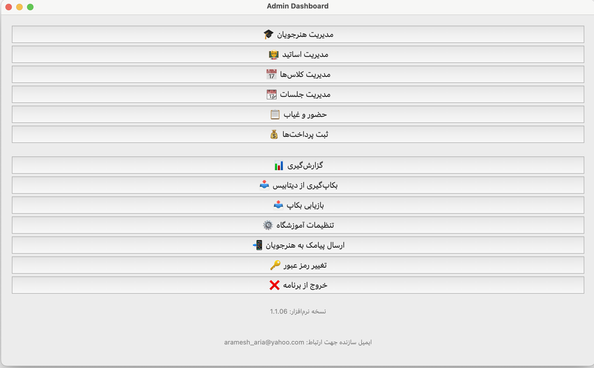
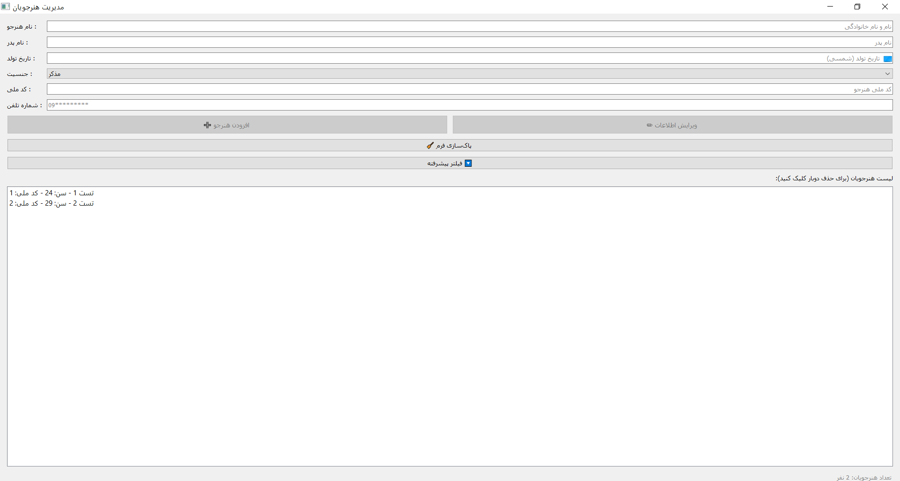
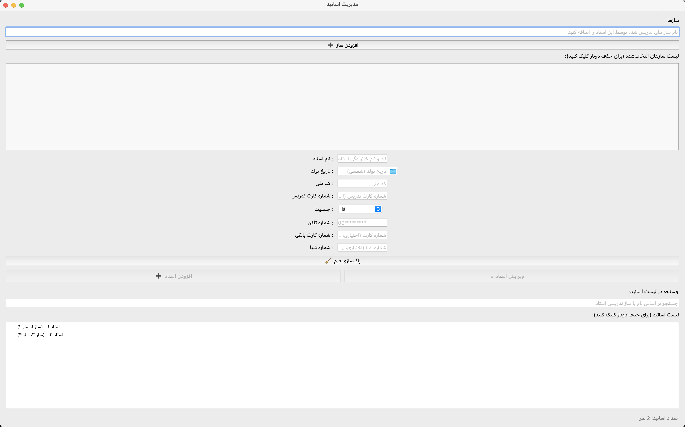
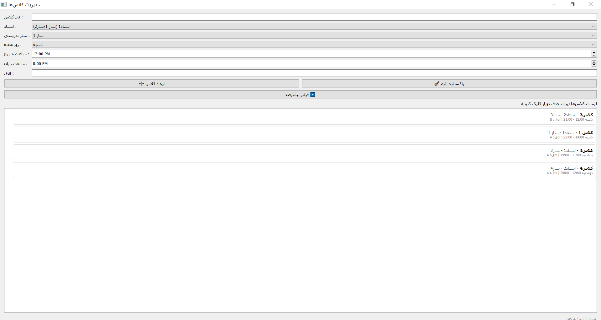
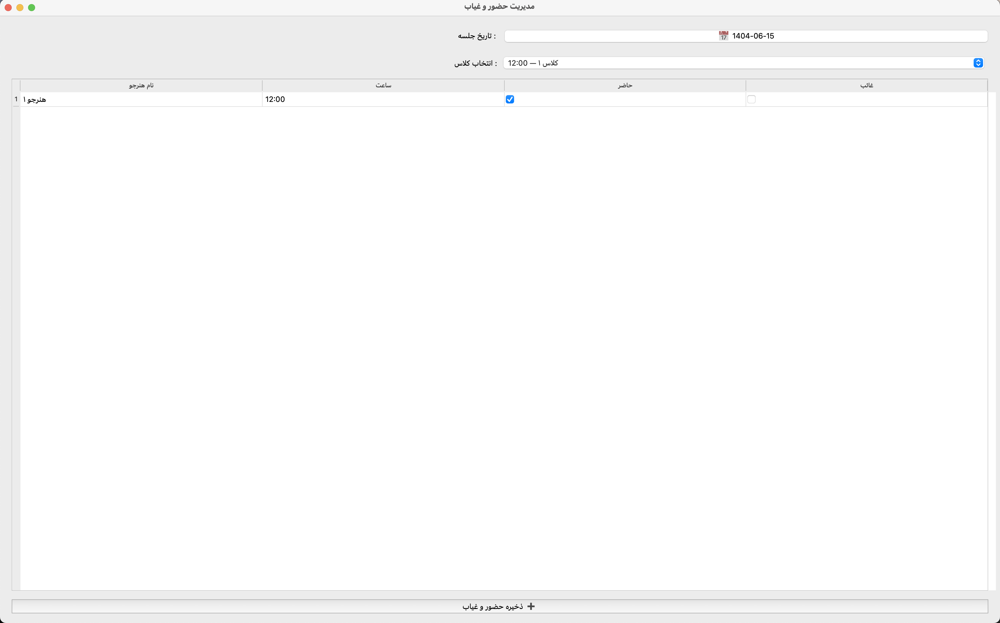
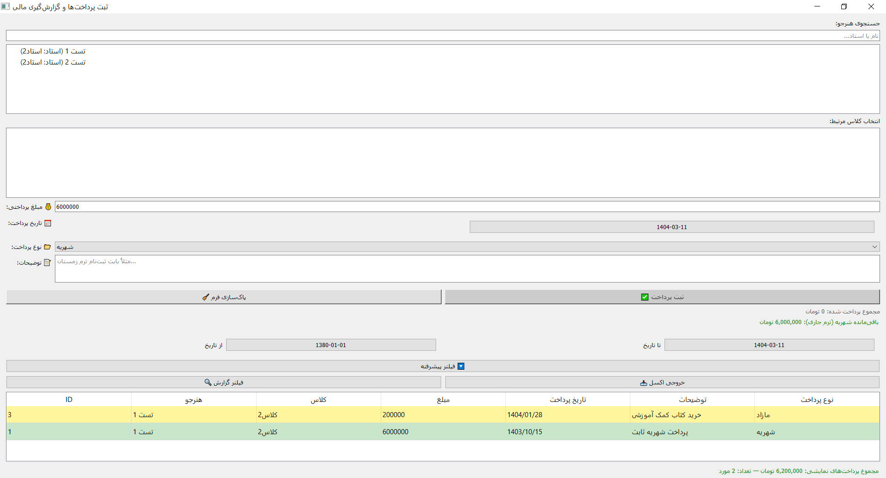

# 🎵 نرم‌افزار مدیریت آموزشگاه موسیقی

نرم‌افزار جامع مدیریت آموزشگاه موسیقی با رابط کاربری گرافیکی (PyQt5) برای سیستم‌عامل ویندوز طراحی شده و شامل تمام نیازهای اجرایی یک آموزشگاه موسیقی از ثبت هنرجو تا گزارش‌های مالی است.

---

## ✨ ویژگی‌ها

📩 ارسال پیامک خودکار در صورت نزدیک شدن به پایان ترم هنرجو

👤 مدیریت هنرجویان و اطلاعات تکمیلی (نام پدر، تاریخ تولد، شماره تماس و...)

👨‍🏫 مدیریت اساتید به همراه سازهای تدریسی، اطلاعات کارت بانکی و کارت تدریس

🏫 ایجاد کلاس‌ها با مشخصات کامل (ساز، روز، ساعت، استاد)

📅 مدیریت جلسات، ترم و تداخل‌های زمانی کلاس

📋 ثبت حضور و غیاب هنرجویان به تفکیک جلسه

💰 ثبت شهریه ترم و پرداخت‌های مازاد با گزارش مالی لحظه‌ای

📊 گزارش‌گیری جامع از:

وضعیت مالی هنرجو

گزارش کلی هنرجویان

گزارش حضور و غیاب جلسات

📱 دفترچه تلفن هنرجویان و اساتید

🔑 سیستم تغییر رمز عبور و تنظیمات پایه آموزشگاه

🧩 نسخه قابل نصب با فعال‌سازی از طریق کد لایسنس

---

## 🖼️ پیش‌نمایش

### داشبورد اصلی

### مدیریت هنرجویان

### مدیریت اساتید

### مدیریت کلاس‌ها

### ثبت حضور و غیاب

### گزارش مالی و پرداخت‌ها

📸 برای مشاهده‌ی تصاویر بیشتر از محیط برنامه: [screenshots/](screenshots/)

---

## ⚙️ نحوه نصب

1. فایل Setup با نام `setup_amoozeshgah.exe` را از [Releases](https://github.com/ariatest/AmoozeshgahApp-repo/releases/tag/v1.0.1) دانلود کنید.
2. فایل را اجرا کنید
3. هنگام نصب، کد لایسنس معتبر وارد نمایید
4. پس از نصب، برنامه به صورت خودکار اجرا خواهد شد.

> نیازمندی‌ها به صورت خودکار نصب می‌شوند (Python Embedded + DLL + VC Redist).

---

## 🛠️ تکنولوژی‌های استفاده‌شده

* زبان برنامه‌نویسی: Python 3.12
* رابط کاربری: PyQt5
* دیتابیس: SQLite
* زمان‌بندی و تقویم: `jdatetime`, `QCalendar`
* نصب و توزیع: Inno Setup + PyInstaller

---

## 🛡 مجوز

این نرم‌افزار تحت مالکیت معنوی توسعه‌دهنده (آریا آرامش) بوده و استفاده، بازنشر یا استفاده تجاری بدون کسب اجازه کتبی ممنوع است.

متن کامل لایسنس را در فایل [LICENSE](LICENSE) مشاهده کنید.

---

## 📬 ارتباط

در صورت نیاز به دریافت نسخه نصب یا دریافت کد فعال‌سازی، لطفاً با توسعه‌دهنده تماس بگیرید.

