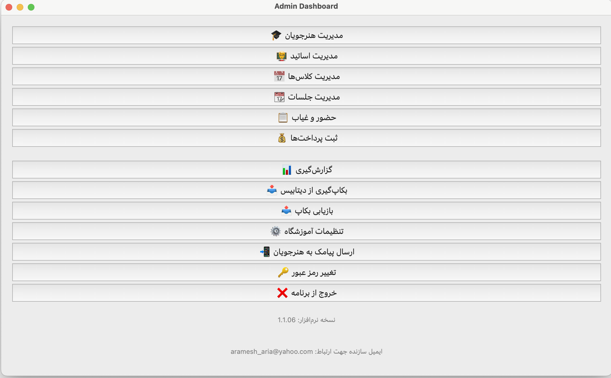
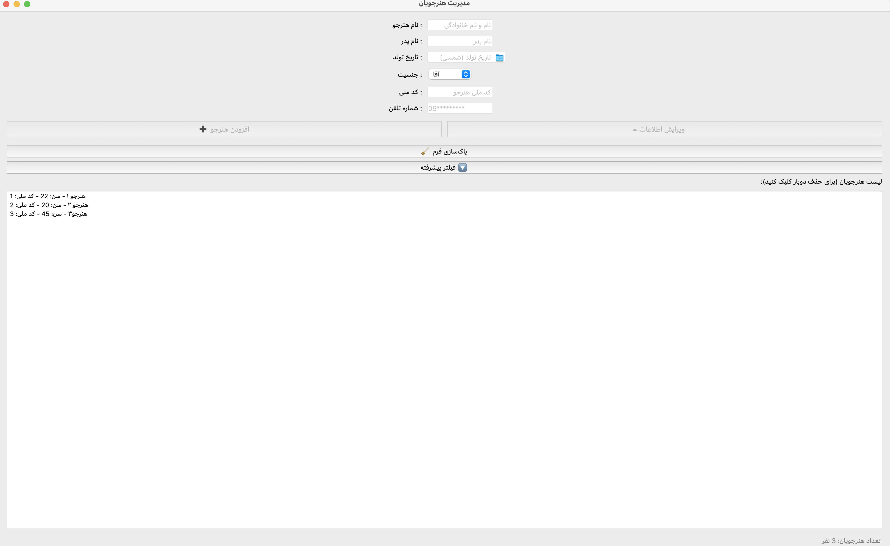
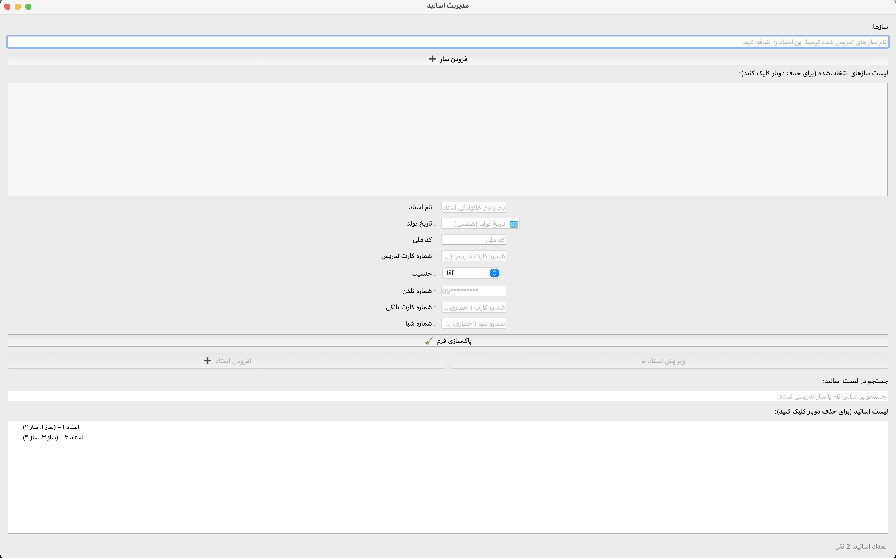
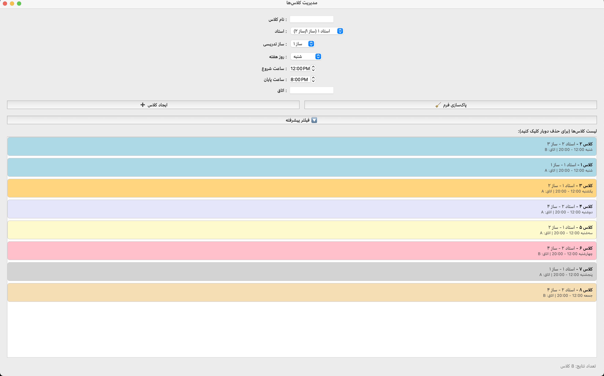
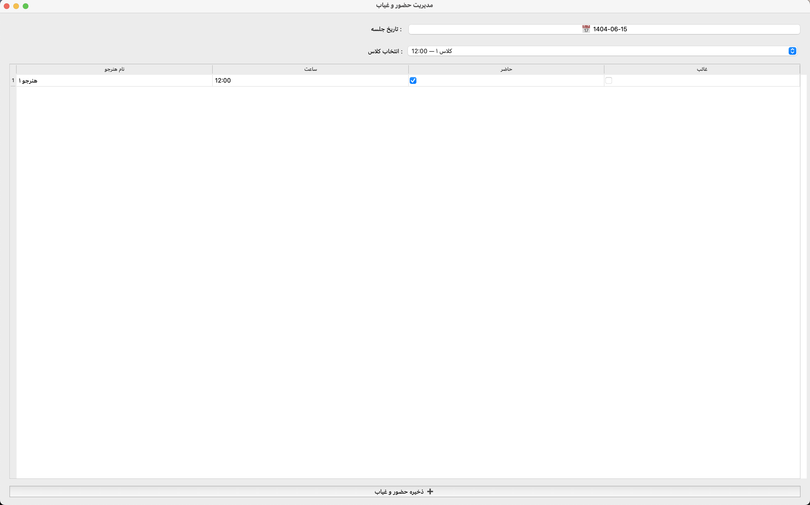
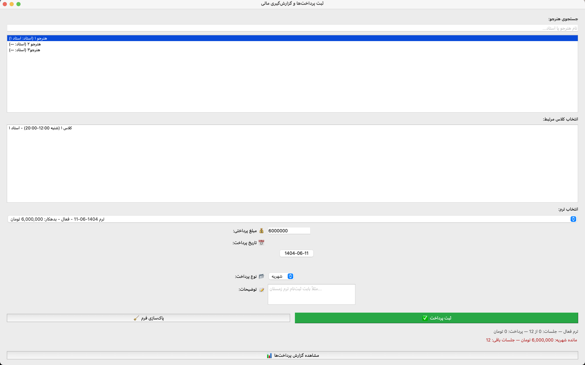

# 🎵 نرم‌افزار مدیریت آموزشگاه موسیقی

نرم‌افزار جامع مدیریت آموزشگاه موسیقی با رابط کاربری گرافیکی (PySide6) برای سیستم‌عامل ویندوز طراحی شده و شامل تمام نیازهای اجرایی یک آموزشگاه موسیقی از ثبت هنرجو تا گزارش‌های مالی است.

---

## ✨ ویژگی‌ها

📩 ارسال پیامک خودکار در صورت نزدیک شدن به پایان ترم هنرجو

👤 مدیریت هنرجویان و اطلاعات تکمیلی (نام پدر، تاریخ تولد، شماره تماس و...)

👨‍🏫 مدیریت اساتید به همراه سازهای تدریسی، اطلاعات کارت بانکی و کارت تدریس

🏫 ایجاد کلاس‌ها با مشخصات کامل (ساز، روز، ساعت، استاد)

📅 مدیریت جلسات، ترم و تداخل‌های زمانی کلاس

📋 ثبت حضور و غیاب هنرجویان به تفکیک جلسه

💰 ثبت شهریه ترم و پرداخت‌های مازاد با گزارش مالی لحظه‌ای

📊 گزارش‌گیری جامع از:

وضعیت مالی هنرجو

گزارش کلی هنرجویان

گزارش حضور و غیاب جلسات

📱 دفترچه تلفن هنرجویان و اساتید

🔑 سیستم تغییر رمز عبور و تنظیمات پایه آموزشگاه

🧩 نسخه قابل نصب با فعال‌سازی از طریق کد لایسنس

---

## 🖼️ پیش‌نمایش

### داشبورد اصلی

### مدیریت هنرجویان

### مدیریت اساتید

### مدیریت کلاس‌ها

### ثبت حضور و غیاب

### گزارش مالی و پرداخت‌ها

📸 برای مشاهده‌ی تصاویر بیشتر از محیط برنامه: [screenshots/](src/screenshots/)

---
## ⚙️ نحوه نصب

1- از صفحه **[Releases](https://github.com/Aramesh-Aria/AcaSmart-repo/releases)** آخرین نسخه را باز کنید.

2- در بخش **Assets**، فایل مناسب معماری سیستم خود را دانلود کنید:
   - **x86 (Intel/AMD)**: فایل دارای عبارت `x86` یا `x86_64`.
   - **arm64 (Apple Silicon / Windows on ARM)**: فایل دارای عبارت `arm64`.
   > در حال حاضر برای هر دو معماری **arm64** و **x86** بیلد ZIP در Releases منتشر می‌شود.

3- فایل ZIP را از حالت فشرده خارج کنید.

4- اجرا:
   - **Windows**: فایل `AcaSmart.exe` را اجرا کنید.
   - **macOS**: پوشه‌ی استخراج‌شده را باز کرده و `AcaSmart.app` را اجرا کنید.
     - اگر Gatekeeper هشدار داد: روی فایل راست‌کلیک کنید → **Open**.

5- هنگام نخستین اجرا، **کد لایسنس معتبر** را وارد کنید.

6- برای به‌روزرسانی، آخرین ZIP مناسب معماری خود را از Releases دانلود کرده و جایگزین نسخه قبلی کنید.

---

## 🛠️ تکنولوژی‌های استفاده‌شده

* زبان برنامه‌نویسی: Python 3.8.10
* رابط کاربری: PySide6
* دیتابیس: SQLite
* نصب و توزیع: Inno Setup + PyInstaller

---

## 🛡 مجوز

این نرم‌افزار تحت مالکیت معنوی توسعه‌دهنده (آریا آرامش) بوده و استفاده، بازنشر یا استفاده تجاری بدون کسب اجازه کتبی ممنوع است.

متن کامل لایسنس را در فایل [LICENSE](LICENSE) مشاهده کنید.

---

## 📬 ارتباط

در صورت نیاز به دریافت نسخه نصب یا دریافت کد فعال‌سازی، لطفاً با توسعه‌دهنده تماس بگیرید.

